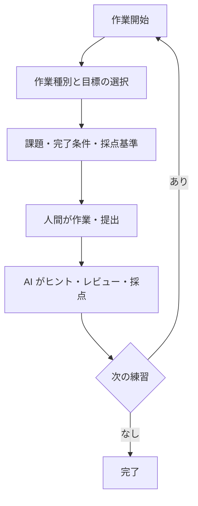

# プロジェクトの進め方

## フロー概要

## 詳細フロー

各フェーズの手順は対応する Skill に記述されている．

| フェーズ | Skill |
|---|---|
| 文法・コード読解 | `rust-snippet-generator` |
| 短い実践課題の出題・進行 | `rust-practice-challenge` |
| Markdown・図による説明 | `markdown-sample-generator` |
| 設計のレビュー・採点 | `design-reviewer` |
| テスト設計のレビュー・採点 | `test-design-reviewer` |
| 実装のレビュー・採点 | `implementation-reviewer` |
| テストコードのレビュー・採点 | `test-code-reviewer` |
| 全工程の総合評価 | `summary-reviewer` |

## 進捗管理

- 必要に応じて，学習メモや Git の履歴で管理する．
